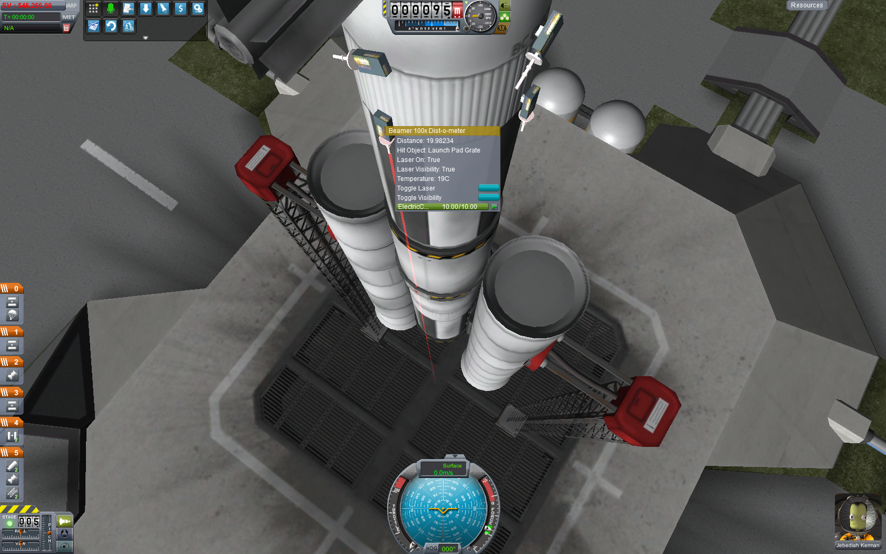
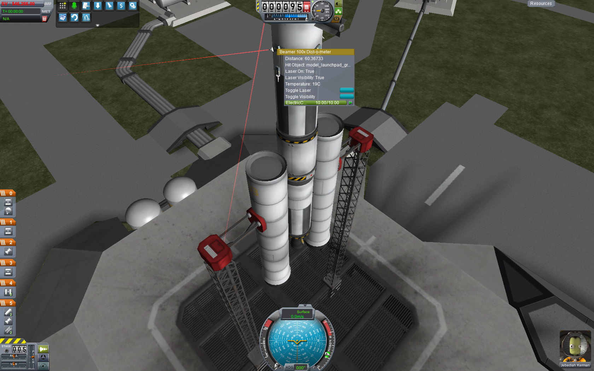
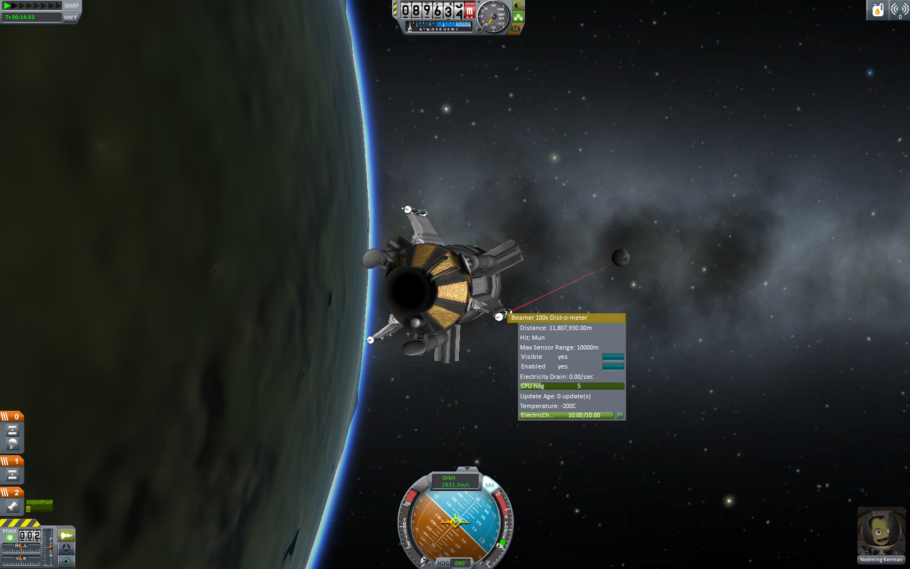
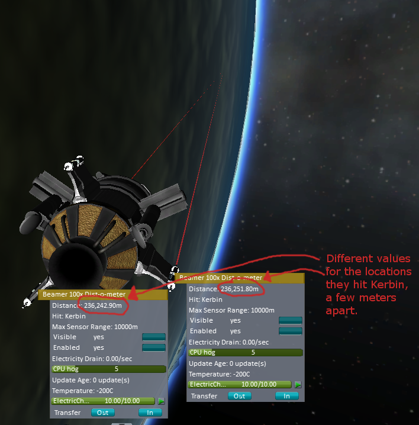
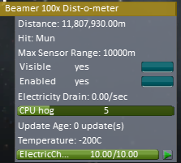

LaserDist
=========

[WIP, Plugin, Parts] LaserDist 0.9 for KSP 1.1.2
------------------------------------------------

Releases:

* https://github.com/Dunbaratu/LaserDist/releases

ZIP Download (See release page above):

Source Code Hosting site:

* https://github.com/Dunbaratu/LaserDist

License:

* GPL v3

Copyright (C) 2014,2015,2016 Steven Mading (aka Dunbaratu on Github)
madings@gmail.com


This is a very small plugin.  It makes a KSP Part that
measures straight line distances by laser.

The "Beamer 100x Disto-o-meter" Part aims a laser in a line
and then measures the distance in meters to the first object
the laser hits.  The result is displayed in the right-click
menu for the part and can be read by kOS (and other?) script
mods.



The direction of the laser is whichever way the laser gun is
pointed when you mounted it on the craft, as demonstrated here:



The laser can work over long distances - here it's measuring the
distance from a Kerbin orbit vessel to the Mun:



And even at those very long distances, the lasers can measure
rather small differences in distace, within reason (it has
an accuracy of 2 meters at this extreme range, to keep the
game from bogging down too much).  In the screenshot below,
notice how the two lasers are returning different numbers for
their distance to the terrain very far away:




The electric draw for the laser is substantial.  Each laser consumes
1 electric charge every 3 seconds that it's on.


### Why does this Mod exist?

The intended purpose of this part is to be used in conjunction with
scripted autopilots like [kOS](https://github.com/KSP-KOS/KOS/releases), to
provide a way to for you to write scripted pilot software that can
see the distance to the ground (or anything else like a ship) along
the laser line.  The reason this can be useful is so you can detect
things like terrain slope and mountains in the way.  The default
radar altimiter in KSP only shows you the distance directly under
the craft.

In a nutshell, the purpose is to solve this problem:


This mod can let you read the distance along the blue line in the diagram.

### Why isn't it inside kOS then?

There is more than one KSP mod project for the purpose of letting
users write scripted autopilots.  Another such project currently under
development is [Jebnix](https://github.com/griderd/Jebnix).

My goal is to make this part script-engine-agnostic so it works with
any such mod.  I've been working in kOS mostly, but I didn't want this
part to be kOS-specific because there's no particular reason it has
to be.

### Information about the data fields the part displays:



* KSPField: 'Distance' is a float - the number of meters being shown in the display.  It's -1 if there is currently no hit.
* KSPField: 'HitName' is a string - the name of the object being hit.
* KSPField: 'Activated' is a bool - true if the measuring device is on. 
* KSPField: 'DrawLaser' is a bool (called "Visible" in the GUI) - true if the laser should be drawn when it's activated or false if it should be (realistically) invisible because, hey, it's coherent light and it's not supposed to be seen from the side.
* KSPField: 'CPUGreedyPercent' is a float (called "CPU hog" in the GUI) ranging from 0.0 to 20.0.  It's how much of a single physics tick of time this mod will allow itself to consume during a single Update.  If it hasn't gotten a good enough answer within that much time, it will wait until the next update to continue the calculation.
* KSPField: 'UpdateAge' is an integer - It's how many Unity Updates (animation frames, basically) it's been since the value you are seeing was calculated.  Becuase of the logic of CPUGreedyPercent (see above) sometimes the value being displayed is stale by a few update ticks and shouldn't be trusted until the next time that UpdateAge becomes zero again.  If you're in a situation where this mod needs to spend more than 1 update of time to get to a good answer for the distance, you'll see this value spinning a bit, quickly going 0,1,2,3,0,1,2,3,0,1,2,3...etc.  When you see that, only when it hit the zeros was the distance value perfectly correct at THAT moment.

Note: The higher that CPUGreedyPercent ("CPU hog") is, the less likely it is that UpdateAge will ever be nonzero, but the bigger hit your framerate might take.

### How to Mount it.

. The Beamer 100x Dist-o-Meter is located in the "Electronics" tech node of the career tech tree. It's a 300-point node on the tree so you might not have it yet in a new fresh career game.

The Laser can be mounted anywhere as a surface-mount item.  Take care to
note the orientation of the laser emiiter.  (KSP lets you fine-tune
the rotation of a part by using the SHIFT key while you hit the WASDQE
keys.)

The Laser will bounce back and give you a distance measurement when
it encounters *ANY* object, including parts of your own craft.  So
take care to mount it somewhere where the laser beam will have a clear
line of sight without obstruction. 

To ensure a good mounting point, you can use "tweakables" to enable the
laser and make it show up in the VAB to look and see if you have it aimed
well.

### Lightspeed 

Note that if you use it to measure the distance to a far away body (i.e.
like aiming it at Duna from Kerbin), the mod does take into account
lightspeed.  You have to hold the laser on an object steady and unchanged
for the entire duration of time it takes for lightspeed delay to
bounce the signal back or you won't get a measurement, so using it at that
great distance will be very hard.

### FUTURE EXPANSION PLANS (i.e. the reason this is a WIP)

**Max distance isn't enforced yet**:  It's part of a future plan
to have different variants of the part that work better the
higher up the tech tree you go.  For now, despite what it says,
the range is actually infinite.

**Other sorts of sensors?**:  Now that the numerical approximation behind
making a "fake raycast" that finds intersections with the planet terrain
from far away and from any angle is implemented, this opens up the
chance that other sorts of long range beam sensors could be made.
For example a "biome detector" that returns the name of the biome
where the hit occurred is a possibility, as is a "density at a distance"
measurement which might tell you the atmospheric pressure or density
at the ground level where the hit occurred.  (Maybe because of something
that the laser detects about interference with the air?  It's a bit
hard to justify realistically how that would work, but it's definitely
possible with the software.  Just not sure if it's possible in the 
real world, or whether real-world sanity is really the intent
of this mod or not.

### How do I use it from my script then?

Quick synopsis:

Getting a handle on the laser, then turning on the laser using that module:
```
SET laser_module TO SHIP:MODULESNAMED("LaserDistModule")[0].
IF not laser_module:GETFIELD("Enabled") {
  laser_module:SETFIELD("Enabled",true).
}
```
Getting a reading from the laser:
```
SET laser_module TO SHIP:MODULESNAMED("LaserDistModule")[0].
PRINT "Laser distance is measuring " + laser_module:GETFIELD("Distance") + " meters."
PRINT "Laser is hitting: " + laser_module:GETFIELD("Hit").
```
Transforming the laser reading into a 3-D coord:

The part model is designed such that emitter of the laser line is located exactly
at the part's local transform origin position, aimed along the part's
``facing:vector`` unit vector, allowing you to get its 3D vector position from
a script like so:

```
SET laser_module TO SHIP:MODULESNAMED("LaserDistModule")[0].
set dist to laser_module:GETFIELD("Distance").
set emitter_position to laser_module:part:position.
set emitter_unit_vec to laser_module:part:facing:vector.
set laser_hit_position to emitter_position + (dist * emitter_unit_vec).
```
// laser_hit_position is now a 3D vector position of where the laser hit something.

```
### Part modeling help?

I am aware that the artwork on the model isn't pretty.  I'm a 
programmer, not a graphic artist, and I don't have experience
with things like Maya and Blender.  In fact I just made the model
by slapping together some stretched Cube and Cylnder objects in
Unity itself, without the aid of a modeling program.  The model
is good enough to work with, but I'd be happy to have someone
better at art redesign the model.  I included the model in
the github directory if you want to have a look.


