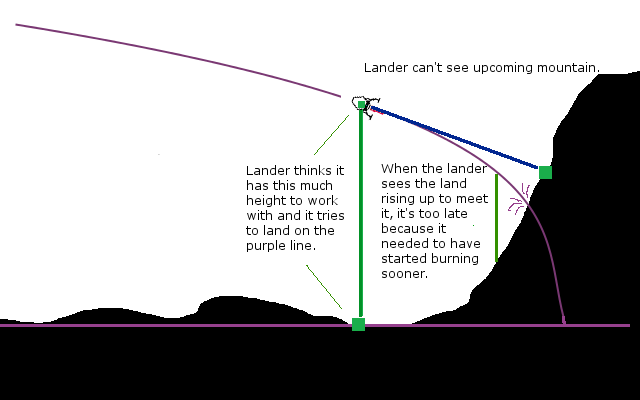

LaserDist
=========

[WIP, Plugin, Parts] LaserDist 0.1 for KSP 0.23.5, Alpha
--------------------------------------------------------

Releases:

* https://github.com/Dunbaratu/LaserDist/releases

ZIP Download (See release page above):

Source Code Hosting site:

* https://github.com/Dunbaratu/LaserDist

License:

* GPL v3

Copyright (C) 2014 Steven Mading (aka Dunbaratu on Github)
madings@gmail.com

This is a vey small plugin.  It makes a KSP Part that
measures straight line distances by laser.

The "Beamer 100x Disto-o-meter" Part aims a laser in a line
and then measures the distance in meters to the first object
the laser hits.  The result is displayed in the right-click
menu for the part.

The direction of the laser is whichever way the laser gun is
pointed when you mounted it on the craft, as demonstrated here:

The electric draw for the laser is substantial.  Each laser consumes
1 electric charge every 3 seconds that it's on.

### Why does this Mod exist?

The intended purpose of this part is to be used in conjunction with
scripted autopilots like [kOS](https://github.com/KSP-KOS/KOS/releases), to
provide a way to for you to write scripted pilot software that can
see the distance to the ground (or anything else like a ship) along
the laser line.  The reason this can be useful is so you can detect
things like terrain slope and mountains in the way.  The default
radar altimiter in KSP only shows you the distance directly under
the craft.

In a nutshell, the purpose is to solve this problem:

This mod can let you read the distance along the blue line in the diagram.

### Why isn't it inside kOS then?

There is more than one KSP mod project for the purpose of letting
users write scripted autopilots.  Another such project currently under
development is [Jebnix](https://github.com/griderd/Jebnix).

My goal is to make this part script-engine-agnostic so it works with
any such mod.  I've been working in kOS mostly, but I didn't want this
part to be kOS-specific because there's no particular reason it has
to be.

### Information for other modders trying to use the part:

As long as the scripting autopilot is designed to be able to query
and/or set KSPFields on parts, it should be able to read the value of
the distance, and turn the laser on and off, as follows:

* KSPField: 'distance' is a float - the number of meters being shown in the display.
* KSPField: 'hitName' is a string - the name of the object being hit.
* KSPField: 'drawLaser' is a bool - true if the beam should be drawn visibly on-screen.  (It can still show a distance number if this is false, but you can't see the red beam.)
* KSPField: 'activated' is a bool - true if the measuring device is on. 

### How to Mount it.

. The Beamer 100x Dist-o-Meter is located in the "Electronics" tech node of the career tech tree. It's a 300-point node on the tree so you might not have it yet in a new fresh career game.

The Laser can be mounted anywhere as a surface-mount item.  Take care to
note the orientation of the laser emiiter.  (KSP lets you fine-tune
the rotation of a part by using the SHIFT key while you hit the WASDQE
keys.)

The Laser will bounce back and give you a distance measurement when
it encounters *ANY* object, including parts of your own craft.  So
take care to mount it somewhere where the laser beam will have a clear
line of sight without obstruction. 

To ensure a good mounting point, you can use "tweakables" to enable the
laser and make it show up in the VAB to look and see if you have it aimed
well.

### Lightspeed 

Note that if you use it to measure the distance to a far away body (i.e.
like aiming it at Duna from Kerbin), the mod does take into account
lightspeed.  You have to hold the laser on an object steady and unchanged
for the entire duration of time it takes for lightspeed delay to
bounce the signal back or you won't get a measurement, so using it at that
great distance will be very hard.

### CURRENT KNOWN LIMITATIONS (i.e. the reason this is a WIP)

These are limitations I plan to work on fixing:

* **Distance only measures accurately when near the terrain!!**.  KSP
unloads the polygon colliders when the terrain is far away from the
craft, causing the laser to be unable to bounce off the terrain.  When
you are more than about 6000-7000km away from terrain, it doesn't seem
to work and instead returns the place where the ray hits the
sea-level sphere under the terrain.  **There is a way to solve this, 
but it involves performing a numerical approximation algorithm, which can
be computationaly expensive, so it's a matter of finding the right
balance between animation speed and accuracy.  That is why for this
version, the fix isn't implemented yet.
* The **Max distance isn't being enforced** yet.  The plan is to
make a few different versions of this part that draw different amounts
of power, and can go different ranges.  But for now despite what it
says, the range is actually infinite.

### How do I use it from my script then?

That hasn't been written yet.  I figured I'd make the part first, and
then once it exists issues about how to integrate it can come later.

But at the moment it still does work as a manual piloting instrument,
which is good enough for a 0.1 release.

The ability to iterate over parts and read their KSPFields (The stuff
you see in the rightclick popup user interface panels) is a planned
future feature of kOS, and that is how this is expected to work once
it works.  By being designed that way it should also be usable by
other mods too.

### Part modeling help?

I am aware that the artwork on the model isn't pretty.  I'm a 
programmer, not a graphic artist, and I don't have experience
with things like Maya and Blender.  In fact I just made the model
by slapping together some stretched Cube and Cylnder objects in
Unity itself, without the aid of a modeling program.  The model
is good enough to work with, but I'd be happy to have someone
better at art redesign the model.  I included the model in
the github directory if you want to have a look.

