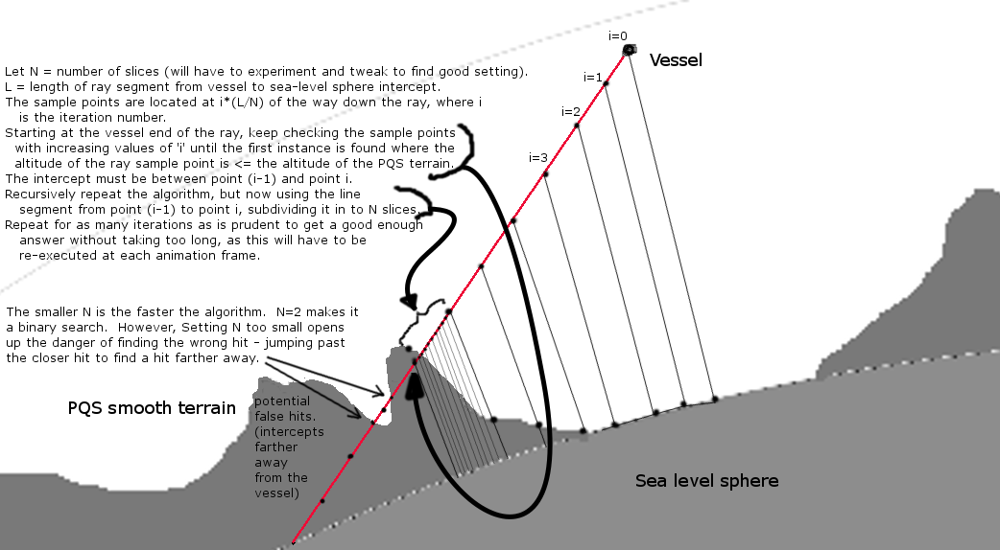

This is the algorithm I'm planning on using to solve the PQS terrain hit problem (the fact that Squad appears to have never implemented an API function to find a ray intersect with the PQS terrain - They did create several API methods that seem by their name to do this, but upon using them I've discovered that despite their name they actually just find the intersect with the sea-level sphere of the planet, ignoring the PQS terrain entirely.)

Given a point in space, I can query KSP and ask it to tell me the PQS terrain below that spot in space. But the math being used to generate that answer is proprietary and hidden, so I can't solve for the intersect of a ray with the terrain surface function analytically (the math would probably be too ugly to do that anyway even if I could see it). I have to solve for it using a numerical algorithm that approximates the answer.

This is how I'm going to try doing it:

If I really wanted to be clever about it and reduce computational expense, I could try to take advantage of the fact that I know that from one animation frame to the next, the correct answer must necessarily be very close to the previous animation frame's correct answer, and therefore start the outermost recursion level with an 'i' just one step away from the previous 'i' that hit. (i.e. if on the previous animation frame, I found the hit in slice i=7, then on the next animation frame, don't start with slice i=0, start with slice i=6, on the assumption that in one animation frame its possible for the correct hit to move across the boundary from one slice to the next, but not possible to move as far as two whole slices in a mere tenth of a second or less.) 
